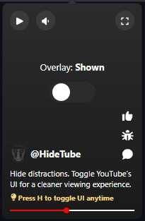
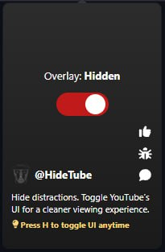
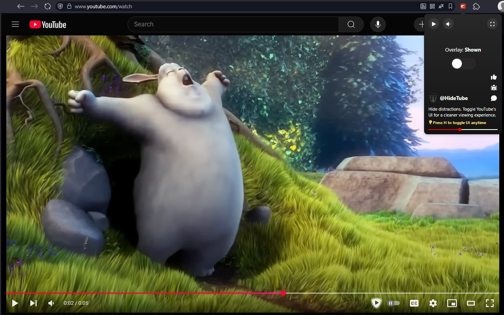
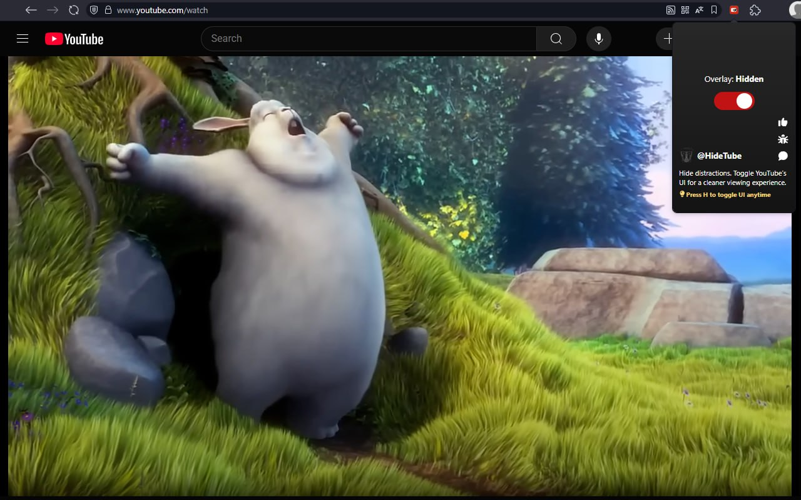

# 🎥 HideTube

A lightweight Chrome extension that hides YouTube's on-screen elements (like video overlays, annotations, and control bars) with a single keypress — for a cleaner, distraction-free viewing experience.

 


---

## ✨ Features

- 🎯 Press H to instantly hide/show YouTube overlays
- 💾 Saves visibility preference across sessions
- 🔄 Automatically re-applies toggle state when navigating videos
- 🧠 Remembers settings even after tab switches or reloads
- ⚡ Lightweight and efficient — no bloat
- 🧩 Works seamlessly with embedded YouTube iframes

---

## 🖥 How It Works

1. Open any YouTube video (`youtube.com/watch?...`) or embed (`youtube.com/embed/...`)
2. Press the `H` key
   _or_
   Open the extension popup and click the Toggle button
3. The following UI elements will be toggled:
   - 🎬 End screens (`.ytp-ce-element`)
   - 🎛 Video controls (`.ytp-chrome-top`, `.ytp-chrome-bottom`)
   - 📝 Annotations (`.annotation`)
     will instantly hide or show
   - 🕹 Pause overlay (in iframes)

Your visibility setting is saved automatically and restored when revisiting or navigating to other videos.

---

## ❓ Why Use It?

- ✅ Removes distractions for focused watching
- 📺 Great for embedded video experiences
- 🧘 Cleaner look = better experience

---

## 🚀 Installation

### From Chrome Web Store

📦 Coming soon...

### 🔧 Manual Installation

Until it's available in the Chrome Web Store, you can install it manually:

1. Download the ZIP
   📥 [Download latest build](https://github.com/Maks-xex/hidetube/releases/download/v1.0/build.zip)
   (or click [releases](https://github.com/Maks-xex/hidetube/releases/tag/v1.0) to view all releases)

2. Extract it
   Unzip the downloaded build.zip file to any location on your computer.

3. Install the Extension:
   - Open Chrome and go to: `chrome://extensions`
   - Enable **Developer Mode**
   - Click **Load unpacked**
   - Select the extracted `build` folder

🎉 Done! The extension should now be active and ready to use.

### 🛠️ From Source (Development Mode)

1. Clone the repository:

   ```bash
   git clone https://github.com/Maks-xex/hidetube.git
   cd hidetube
   ```

2. Install dependencies:

   ```bash
   npm install
   ```

3. Build the extension:

   ```bash
   npm run build
   ```

4. Open Chrome and go to: `chrome://extensions`

5. Enable **Developer mode** (top right)

6. Click **Load unpacked**, then select the generated `build/` folder
